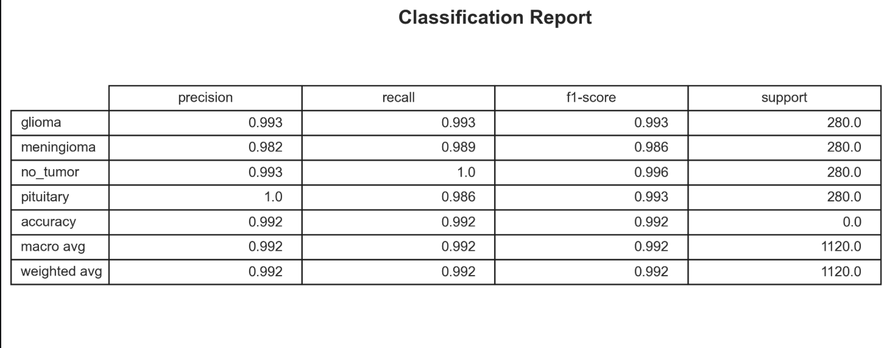
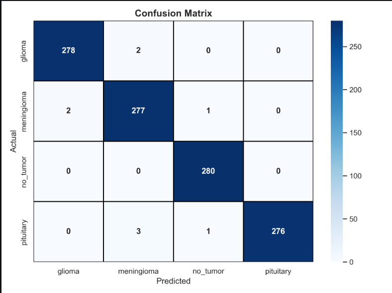
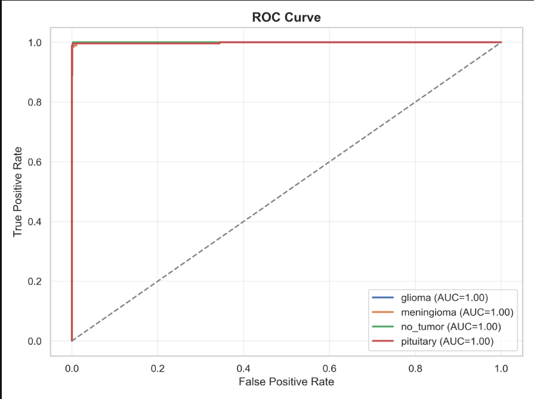
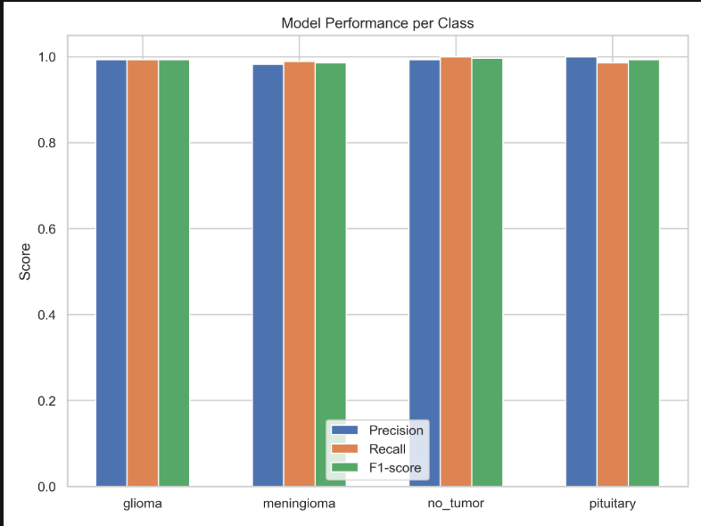

# Brain Tumor Classification using EfficientNet-B0

## 1. Introduction

Brain tumor classification is a critical task in medical image analysis, aimed at identifying and categorizing tumors from MRI scans. Accurate classification assists in diagnosis, treatment planning, and prognosis evaluation.

This module implements a deep learning-based approach using a fine-tuned convolutional neural network to classify brain MRI images into the following categories:

* Glioma
* Meningioma
* Pituitary Tumor
* No Tumor

The model leverages transfer learning to extract high-level features from medical images and achieves strong performance across all classes.

---

## 2. Dataset

Dataset - [kaggle](https://www.kaggle.com/datasets/masoudnickparvar/brain-tumor-mri-dataset)

### Dataset Characteristics

* Multi-class classification problem (4 classes)
* MRI images categorized into:

  * Glioma
  * Meningioma
  * Pituitary
  * No Tumor
* Balanced dataset with equal representation across classes

This dataset is widely used for benchmarking deep learning models in medical imaging due to its structured labeling and diversity.

---

## 3. Theoretical Background

### 3.1 Convolutional Neural Networks (CNNs)

CNNs are designed to process grid-like data such as images. They consist of:

* Convolutional layers (feature extraction)
* Activation functions (non-linearity)
* Pooling layers (dimensionality reduction)
* Fully connected layers (classification)

In medical imaging, CNNs are effective at capturing spatial patterns such as tumor boundaries and textures.

---

### 3.2 Transfer Learning

Training deep networks from scratch requires large datasets. Transfer learning addresses this by:

* Using a model pretrained on large datasets (e.g., ImageNet)
* Reusing learned feature representations
* Fine-tuning for a specific task

This significantly improves performance and reduces training time.

---

## 4. Model Architecture

### 4.1 Base Model: EfficientNet-B0

EfficientNet introduces a compound scaling method that uniformly scales:

* Network depth
* Width
* Input resolution

This results in better performance with fewer parameters compared to traditional CNNs.

The base model is initialized with pretrained weights:

```python
self.model = models.efficientnet_b0(weights="DEFAULT")
```

---

### 4.2 Modified Classification Head

The original classification layer is replaced with a custom architecture:

```python
Dropout(0.4)
→ Linear (in_features → 256)
→ ReLU
→ BatchNorm
→ Linear (256 → num_classes)
```

#### Purpose of Each Component

* **Dropout (0.4):** Prevents overfitting by randomly deactivating neurons
* **Linear Layer:** Reduces feature dimensionality
* **ReLU:** Introduces non-linearity
* **Batch Normalization:** Stabilizes training and improves convergence
* **Final Linear Layer:** Maps features to class probabilities

---

## 5. Performance Evaluation

### 5.1 Overall Accuracy

The model achieves:

**Accuracy: 99.2%**

This indicates strong classification capability across all tumor categories.

---

### 5.2 Classification Report

<p align="center">
  
</p>

The classification report shows:

* High precision and recall across all classes
* Balanced performance (macro and weighted averages ≈ 0.992)
* Minimal misclassification

---

### 5.3 Confusion Matrix

<p align="center">
  
</p>

Observations:

* Most predictions lie along the diagonal (correct classifications)
* Very few misclassifications between similar tumor types
* Perfect classification for the "No Tumor" class

---

### 5.4 ROC Curve

<p align="center">
  
</p>

Observations:

* AUC ≈ 1.00 for all classes
* Indicates excellent separability between classes

---

### 5.5 Class-wise Performance

<p align="center">
  
</p>

Observations:

* Precision, recall, and F1-score are consistently high
* Slight variation in meningioma class due to similarity with other tumors

---
### 5.6 Sample Prediction with Confidence Scores

<p align="center">
  
</p>

The model outputs class probabilities using a softmax function applied to the final logits.

In this example:

- Meningioma: 0.98  
- Glioma: 0.01  
- Pituitary: 0.01  
- No Tumor: 0.00  

The model predicts **Meningioma** with high confidence (98%), indicating strong certainty in classification.
The probabilities are obtained using the softmax function applied to the output logits of the neural network.

Confidence scores provide insight into the model's reliability and are particularly useful in real-world medical decision-making scenarios.

## 6. Discussion

The high performance of the model can be attributed to:

* Effective feature extraction using EfficientNet
* Use of transfer learning
* Balanced dataset
* Regularization techniques (dropout, label smoothing)
* Adaptive optimization and learning rate scheduling

The model demonstrates strong generalization and robustness across all tumor classes.

---

## 7. Conclusion

This classification module successfully demonstrates the application of deep learning in medical image analysis. The use of EfficientNet-B0 combined with modern training techniques results in high accuracy and reliable performance.

The model serves as a strong foundation for downstream tasks such as segmentation and explainability.

---

