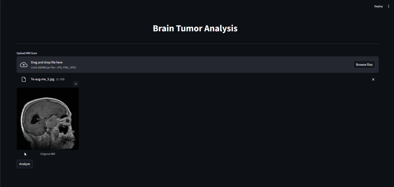
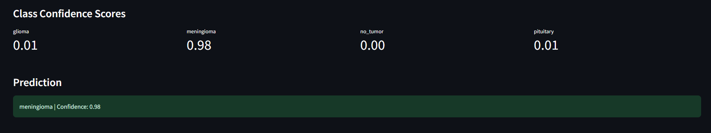
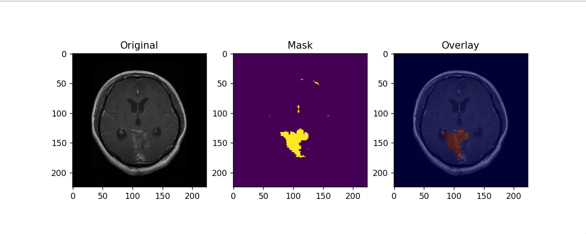
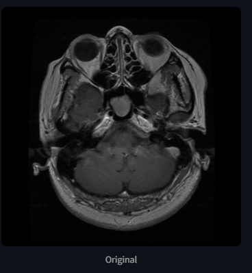
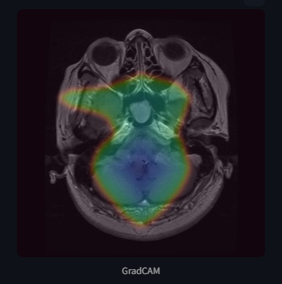

# Brain Tumor Detection and Analysis using Deep Learning

## Demo
<p align="center">
  
</p>

If the video does not load, you can view it here:
[Watch Demo Video](media/Demo_video.mp4)

---

## Overview

This project presents a comprehensive deep learning pipeline for brain tumor analysis using MRI images. It integrates three core components—classification, segmentation, and explainability—to provide not only accurate predictions but also meaningful insights into model behavior.

Unlike traditional models that only output predictions, this system is designed to:

* Identify the type of tumor present in MRI scans
* Precisely localize tumor regions
* Explain the reasoning behind model predictions

This combination makes the system more reliable and interpretable, which is essential in medical applications.

---

## Project Pipeline

The pipeline consists of three interconnected modules:

---

## 1. Classification

### Description

The classification module is responsible for predicting the type of brain tumor present in an MRI image. It is built using a transfer learning approach with EfficientNet-B0, allowing the model to leverage pre-trained features for improved performance.

The model classifies images into four categories:

* Glioma
* Meningioma
* Pituitary
* No Tumor

---

### Results

* Accuracy: **99.2%**
* High precision, recall, and F1-score across all classes

<p align="center">
  
</p>

The model also provides confidence scores for each class, enabling better interpretability of predictions.

---

### Detailed Explanation

For complete architecture, training details, and evaluation metrics:

➡️ [Classification README](Classification/README.md)

---

## 2. Segmentation

### Description

The segmentation module performs pixel-wise classification to identify the exact tumor region in MRI images. It is implemented using a U-Net architecture, which is well-suited for biomedical image segmentation.


---

### Results

* Accuracy: **0.9864**
* Increasing Dice Score during training
* Stable training loss convergence

<p align="center">
  
</p>

The overlay visualization shows strong alignment between predicted tumor regions and the actual tumor area.

---

### Detailed Explanation

For architecture, dataset details, and training methodology:

➡️ [Segmentation README](Segmentation/README.md)

---

## 3. Explainability (Grad-CAM)

### Description

The explainability module uses Grad-CAM to visualize the regions of the MRI image that influenced the classification model’s decision.

Instead of acting as a black box, the model highlights areas that contributed to its prediction, improving transparency and trust.

---

### Results

<p align="center">
  <table>
    <tr>
      <td align="center"><b>Original</b></td>
      <td align="center"><b>Grad-CAM</b></td>
    </tr>
    <tr>
      <td></td>
      <td></td>
    </tr>
  </table>
</p>

The highlighted regions correspond to tumor areas, indicating that the model is focusing on meaningful features.

---

### Detailed Explanation

For mathematical formulation and implementation details:

➡️ [Grad-CAM README](Explainability/README.md)

---

## Combined Insight

Each module plays a distinct role:

* Classification → Determines *what type of tumor is present*
* Segmentation → Determines *where the tumor is located*
* Grad-CAM → Explains *why the model made that prediction*

Together, they form a complete and interpretable medical imaging pipeline.

---

## Project Structure

```bash
Brain_Tumor/
├── Classification/
├── Segmentation/
├── Explainability/
├── media/
├── app.py
├── config.py
├── requirements.txt
```

---

## Technologies Used

| Technology     | Role in Project                                                                                                                                                            |
| -------------- | -------------------------------------------------------------------------------------------------------------------------------------------------------------------------- |
| PyTorch        | Core deep learning framework used to build and train the classification (EfficientNet) and segmentation (U-Net) models, and to implement Grad-CAM using autograd and hooks |
| Torchvision    | Provided pretrained EfficientNet-B0 model and image transformation utilities                                                                                               |
| OpenCV         | Used for image processing, resizing, heatmap generation, and overlaying Grad-CAM and segmentation outputs                                                                  |
| NumPy          | Used for numerical computations, array manipulation, and processing gradients and activations in Grad-CAM                                                                  |                                                                                                                                                               |
| Streamlit      | Built the interactive web application for uploading images and visualizing classification, segmentation, and Grad-CAM outputs                                              |
| Matplotlib     | Used for plotting training curves, Dice score, and visualizing outputs                                                                                                     |
| Scikit-learn   | Used for evaluation metrics such as confusion matrix, classification report, and ROC curve                                                                                 |
| Pillow (PIL)   | Used for image loading and basic preprocessing operations                                                                                                                  |

---

## How to Run

```bash
pip install -r requirements.txt
streamlit run app.py
```

---

## Conclusion

This project demonstrates a complete deep learning workflow for medical image analysis by combining prediction, localization, and interpretability. The integration of classification, segmentation, and explainability makes the system both accurate and transparent, which is critical for real-world healthcare applications.

---
