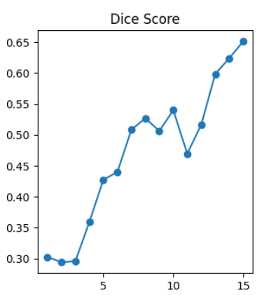
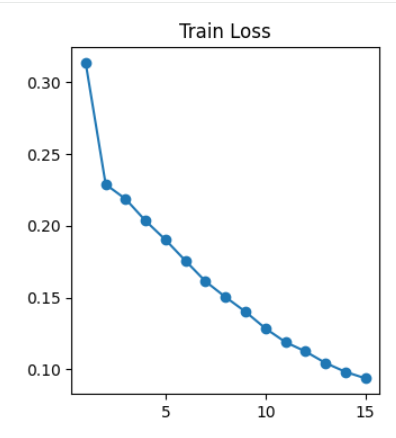

# Brain Tumor Segmentation using U-Net

## 1. Introduction

Image segmentation is a fundamental task in medical imaging that involves assigning a class label to each pixel in an image. In the context of brain tumor analysis, segmentation enables precise localization of tumor regions within MRI scans.

This module implements a convolutional neural network based on the U-Net architecture to perform pixel-wise segmentation of brain tumors.

---

## 2. Objective

The objective of this module is to:

* Identify tumor regions at a pixel level
* Generate binary masks separating tumor and background
* Provide precise localization for medical interpretation

---

## 3. Dataset


### Dataset Description

* Each sample consists of:

  * MRI Image
  * Corresponding Mask (Ground Truth)

* The dataset includes four categories:

  * No Tumor
  * Glioma
  * Meningioma
  * Pituitary

* The masks represent tumor regions within MRI images.

---

## 4. Theoretical Background

### 4.1 Image Segmentation

Unlike classification, which assigns a single label to an image, segmentation performs dense prediction by classifying each pixel individually.

---

### 4.2 Convolutional Neural Networks for Segmentation

CNNs are effective for segmentation because they:

* Capture spatial hierarchies
* Learn local and global patterns
* Preserve spatial relationships

However, standard CNNs reduce resolution through pooling. This is addressed using encoder-decoder architectures.

---

### 4.3 U-Net Architecture

U-Net is a widely used architecture for biomedical image segmentation consisting of:

* Encoder (contracting path)
* Bottleneck
* Decoder (expanding path)

---

#### Encoder

* Extracts features using convolution layers
* Reduces spatial dimensions using pooling
* Captures contextual information

---

#### Bottleneck

* Connects encoder and decoder
* Learns high-level representations

---

#### Decoder

* Upsamples feature maps
* Restores spatial resolution
* Produces pixel-wise predictions

---

### 4.4 Skip Connections

Skip connections combine encoder and decoder features:

```python
torch.cat([u2, e2], dim=1)
```

They help:

* Preserve fine details
* Improve localization accuracy
* Prevent information loss

---

## 5. Model Architecture (Implementation)

The implemented U-Net consists of:

* Two encoder blocks
* One bottleneck
* Two decoder blocks
* Final output layer

---

### Encoder

```python
Conv2d → ReLU → Conv2d → ReLU → MaxPool
```

---

### Bottleneck

```python
Conv2d(128 → 256) → ReLU
Conv2d(256 → 256) → ReLU
```

---

### Decoder

```python
ConvTranspose2d → Concatenation → Conv2d
```

---

### Final Layer

```python
nn.Conv2d(64, 2, 1)
```

* Produces pixel-wise class scores
* Output channels = 2 (tumor / background)

---

## 6. Performance Evaluation

### 6.1 Accuracy

**Segmentation Accuracy: 0.9864**

This indicates strong agreement between predicted masks and ground truth.

---

### 6.2 Dice Score

<p align="center">
  
</p>

The Dice Score measures overlap between predicted and actual masks.

Observations:

* Dice score increases over training
* Indicates improved segmentation performance

---

### 6.3 Training Loss

<p align="center">
  
</p>

Observations:

* Loss decreases steadily
* Indicates stable convergence

---

## 7. Visualization of Results

<p align="center">
  
</p>

The output includes:

* Original MRI image
* Predicted mask
* Overlay visualization

---

## 8. Interpretation

* The model successfully identifies tumor regions
* The overlay aligns with tumor structures
* Indicates effective spatial feature learning

---

## 9. Relationship with Classification and Grad-CAM

This module complements other components of the project.

---

### Segmentation vs Classification

| Aspect | Segmentation    | Classification |
| ------ | --------------- | -------------- |
| Output | Pixel-wise mask | Class label    |
| Task   | Localization    | Prediction     |
| Detail | High            | Low            |

---

### Segmentation vs Grad-CAM

| Aspect    | Segmentation | Grad-CAM       |
| --------- | ------------ | -------------- |
| Output    | Exact mask   | Heatmap        |
| Precision | High         | Approximate    |
| Purpose   | Localization | Explainability |

---

### Combined Understanding

* Classification determines **what** the tumor type is
* Segmentation determines **where** the tumor is
* Grad-CAM explains **why** the model made the prediction

---

## 10. Limitations

* Performance depends on dataset quality
* May struggle with very small tumor regions
* Requires annotated masks for training

---

## 11. Conclusion

The U-Net based segmentation model effectively performs pixel-wise tumor localization in MRI images. Combined with classification and Grad-CAM, it forms a complete and interpretable pipeline for brain tumor analysis.

---

